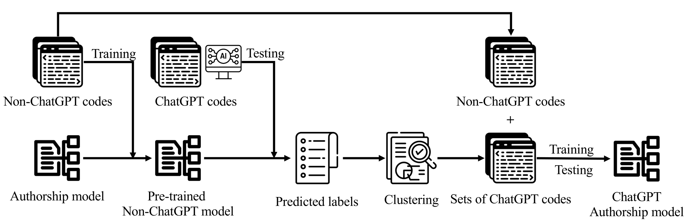
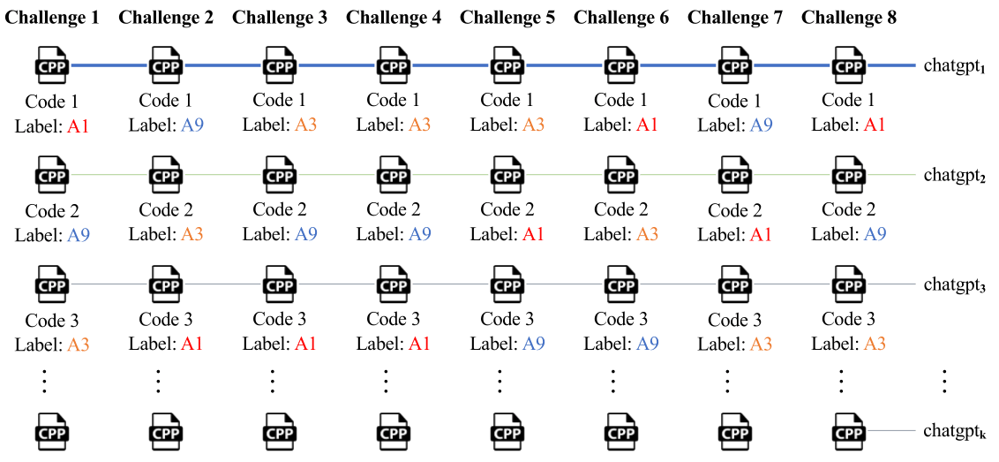
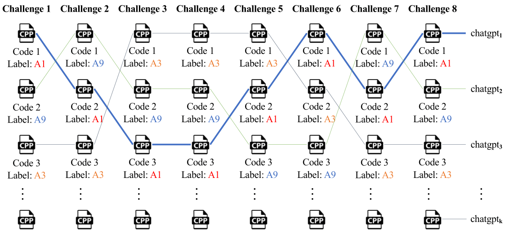

# Attributing ChatGPT-Generated Source Codes

> **Soohyeon Choi** and **David Mohaisen**
> *IEEE Transactions on Dependable and Secure Computing (TDSC), Vol. 22, No. 4, July/August 2025*
> DOI: [10.1109/TDSC.2025.3535218](https://doi.org/10.1109/TDSC.2025.3535218)

## Overview

AI assistants such as ChatGPT have remarkable capabilities for producing both natural language and programming language outputs. While useful, these capabilities raise concerns: ChatGPT can facilitate academic misconduct by generating code for assignments, and ChatGPT-generated code has been shown to be less secure. Although detection of ChatGPT-generated *text* has been addressed, **ChatGPT code authorship attribution remains largely unexplored**.

This work investigates whether off-the-shelf code authorship attribution techniques can attribute ChatGPT-generated code, and proposes a new feature-based approach when the answer turns out to be negative.

<p align="center">
  
</p>

## Key Results

| Approach | Accuracy |
|----------|----------|
| Naive (joint training) | 8.3% -- 29.2% |
| **Ours (feature-based)** | **81.2% -- 93.7%** |
| Binary (ChatGPT vs. Human) | 87% with 6K samples |

## Approach

### Naive Approach

The naive approach jointly trains a model on both ChatGPT and non-ChatGPT code samples. For each user, ChatGPT is prompted in separate sessions to solve coding challenges, and the resulting samples are combined with human-authored code for attribution.

<p align="center">
  
</p>

### Feature-Based Approach (Ours)

Our approach trains a code authorship attribution model using **non-ChatGPT code only**, then uses the inference step to predict labels for ChatGPT-generated code. Codes receiving the same predicted label are grouped under a unified ChatGPT identifier. A jointly trained model is then built using both the original non-ChatGPT labels and the newly assigned ChatGPT group labels.

<p align="center">
  
</p>

## Repository Structure

```
ChatGPTAttribution/
├── assets/                         # Figures and paper PDF
│   ├── authorship-1.png
│   ├── naive-1.png
│   ├── ours-1.png
│   └── chatgpt_authorship.pdf
├── data/
│   └── ChatGPT/
│       ├── GCJ_2017_Test/          # Google Code Jam 2017 test dataset
│       ├── GCJ_2018_Test/          # Google Code Jam 2018 test dataset
│       ├── ChatGPT_feature_based.zip   # Feature-based approach dataset
│       └── ChatGPT_naive.zip           # Naive approach dataset
└── src/
    └── code-imitator-master/       # Attribution & feature extraction pipeline
        ├── data/                   # Feature extraction scripts
        └── src/
            ├── PyProject/          # Python classification & evaluation
            ├── LibToolingAST/      # Clang-based AST feature extraction
            ├── CodeStyloJava/      # Java-based lexical/layout features
            └── ExternalTransformers/   # Optional external tools (e.g., IWYU)
```

## Getting Started

### Prerequisites

- Python 3.x
- LLVM/Clang 5.0.0 (for AST feature extraction)
- Java 8+ (optional, for lexical/layout features)
- GNU Parallel, CMake >= 3.9, Boost headers

### ChatGPT Stylistic Analysis

1. **Data preparation** -- Unzip either [GCJ_2017](data/ChatGPT/GCJ_2017_Test) or [GCJ_2018](data/ChatGPT/GCJ_2018_Test) test dataset and place it in `src/code-imitator-master/data/dataset_2017/`.

2. **Extract features:**
   ```bash
   cd src/code-imitator-master/data/
   bash extractfeatures_single.sh
   ```

3. **Set up classifier** -- Unzip [random_forest_204](src/code-imitator-master/src/PyProject/RF_204) and place it in `src/code-imitator-master/src/PyProject/`.

4. **Run** -- See detailed instructions in [src/code-imitator-master/src/README.md](src/code-imitator-master/src/README.md) (adapted from [Erwin et al.](https://github.com/EQuiw/code-imitator)).

### Attribution Accuracy Analysis

1. **Data preparation** -- Unzip either [ChatGPT_feature_based](data/ChatGPT/ChatGPT_feature_based.zip) or [ChatGPT_naive](data/ChatGPT/ChatGPT_naive.zip) and place it in `src/code-imitator-master/data/dataset_2017/`.

2. **Extract features:**
   ```bash
   cd src/code-imitator-master/data/
   bash extractfeatures_single.sh
   ```

3. **Set up classifier** -- Unzip either [RF_210_feature_based](src/code-imitator-master/src/PyProject/RF_210_feature_based) or [RF_210_naive](src/code-imitator-master/src/PyProject/RF_210_naive) and place it in `src/code-imitator-master/src/PyProject/`.

4. **Run:**
   ```bash
   bash start_train_models_parallel.sh
   ```

## Citation

If you find this work useful, please cite:

```bibtex
@article{choi2025attributing,
  title={Attributing ChatGPT-Generated Source Codes},
  author={Choi, Soohyeon and Mohaisen, David},
  journal={IEEE Transactions on Dependable and Secure Computing},
  volume={22},
  number={4},
  year={2025},
  publisher={IEEE},
  doi={10.1109/TDSC.2025.3535218}
}
```

## Acknowledgments

The code authorship attribution pipeline is adapted from [code-imitator](https://github.com/EQuiw/code-imitator) by Erwin Quiring et al.

## License

This project is intended for research purposes only.
